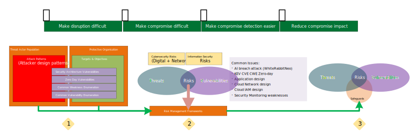
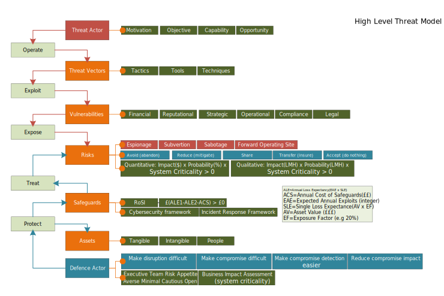

# Information Security Management System (ISMS)

An ISMS approach to managing the security process for a small to medium sized project.

If you work in a project based environment structure where teams of individuals are corralled by a project management team effort to build and deploy a solution, and along the way, you have to work out how to secure the environments being constructed, then this article may help you get a grasp of a methodology that you can start using with relatively low effort.

The background for this article stems from investing time looking at an improved appoach to the controlled risk based methods we can apply to projects

## Contents
- [Introduction](#Introduction)
- [High level conceptual Threat Model](#high-level-conceptual-threat-model)
- [An ISMS approach](#an-isms-approach)
- [ISMS for small projects](#isms-for-small-projects)

## Introduction

[]

## High level conceptual Threat Model

[]

## An ISMS approach

[]

## ISMS for small projects

[]

&nbsp;

