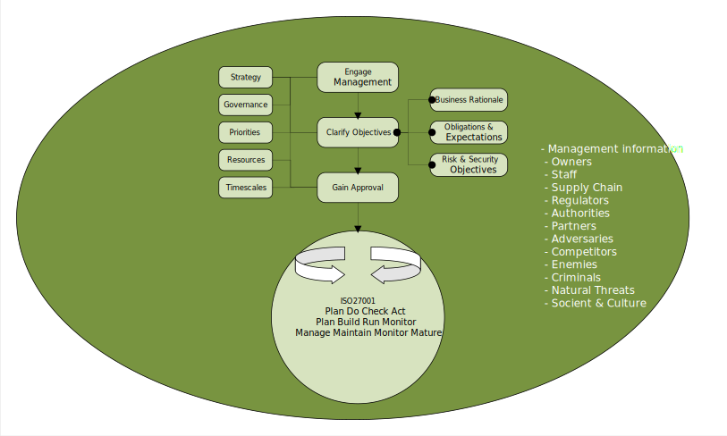
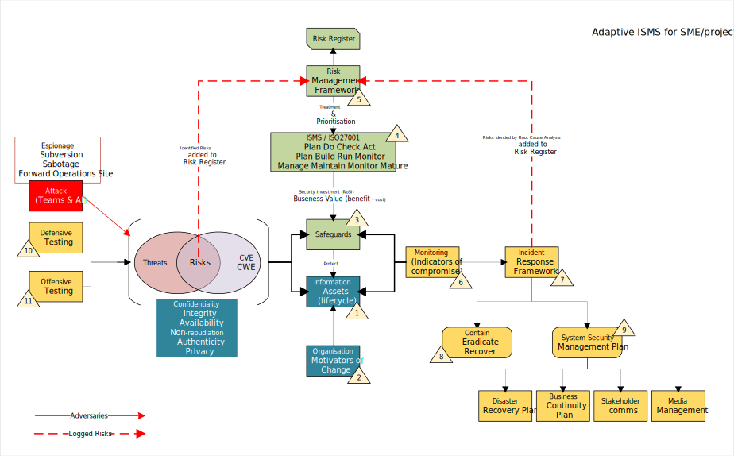

# Information Security Management System (ISMS)

An ISMS approach to managing the security process for a small to medium sized project.

If you work in a project based environment structure where teams of individuals are corralled by a project management team effort to build and deploy a solution, and along the way, you have to work out how to secure the environments being constructed, then this article may help you get a grasp of a methodology that you can start using with relatively low effort.

The background for this article stems from investing time looking at an improved appoach to the controlled risk based methods we can apply to projects

## Contents
- [Introduction](#Introduction)
- [High level conceptual Threat Model](#high-level-conceptual-threat-model)
- [An ISMS approach](#an-isms-approach)
- [ISMS for small projects](#isms-for-small-projects)

## Introduction

[]

The evolution and journey of protecting a information system starts with the 4 basic principles, which are:
A. We want to make it difficult for a threat actor to cause disruption
B. The threat actor must find it difficult to compromise the system, mostly so the actor gives up and tried another system, but also because we want to at least try and keep the actor out of our systems.
C. Lets just assume that a threat actor will eventually gain access our systems.  Lets be real here, a threat actor will event gain access to our systems.  There are a lot of talented hackers in the world, and some of them have access to Breach Attack Simulation tooling, and others have access to the AI WhiterabitNeo tools.  Others, no names mentioned, have very deep pockets and the best tools, and designed, developed, and purchased backdoors.  So when the hack teams steps into our system environment, I personally want all them to step into my traps, and cause the alarms to ring.
D. After the threat actor has accessed our environment, we should try to keep the actor at the original system, and try to stop any further pivoting, or expanding of operations.  At the very least we coud kick the attacker off the systems and restore from a good backup point.

With the 4 principles A-D in mind, we start our ISMS journey at stage 1 (see the diagram).

At stage 1:

* the threat actor has developed and acquired tooling, and researched our staff and organisational footprint, and are now ready to start a chain of events that will lead to compromising our systems.
* we on the other hand, have built and asset register and started to appreciate the we have some vulnerabilities that we should mitigate.
* For the most part, the vulnerabilities are bugs in middle tier application systems and host operating system packages.
* Lets just assume there are zero day vulnerabilities we have no way of finding, until they are published.
* There are configuration weaknesses in our systems, like our Linux password complexity algorithm allows zero length passwords.
* The architecture pattern we designed for the solution has a number of weakness, for example, our internet facing solution does not have a Next Generation Firewall and/or WAF at the border of the public facing network.  Unusual in a professionally managed corporate DMZ, but highly likely in a IaaS cloud solution created by an IT consultancy business, or one of your non IT shadow cloud enthusiasts.

## High level conceptual Threat Model

[]

## An ISMS approach

[]

## ISMS for small projects

[]

&nbsp;

