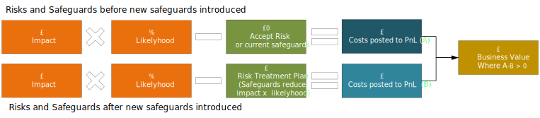

---

##### Published 19/11/2024 10:37:55; Revised: Never

# Selling InfoSec

This paper is not about selling, it is about influencing and motivating your colleagues and customers to look at InfoSec, and more specifically, Cybersecurity, as an opportunity to increase business value by reducing the cost of adverse security outcomes.

Lets get started.

## Contents
- [Introduction](#Introduction)
- [What is InfoSec](#What-is-InfoSec)
- [Why is Cyber Security Marketing is Super Hard?](#Why-is-Cyber-Security-Marketing-is-Super-Hard?)
- [How do we portray the InfoSec vision](#How-do-we-portray-the-InfoSec-vision)
- [What can we do to reduce tollerated risk?](#What-can-we-do-to-reduce-tollerated-risk)
- [Prioritise the Risk treatment sequence](#Prioritise-the-Risk-treatment-sequence)
- [How do we find and demonstrate InfoSec Business Value?](#How-do-we-find-and-demonstrate-InfoSec-Business-Value)

## Introduction

Selling information security (infosec) within an organisation requires a strategic approach that emphasizes the value of security as a foundational element of the organization’s success. Begin by framing infosec not just as a technical necessity but as a critical business enabler. Highlight how strong security measures can protect sensitive data, maintain customer trust, and comply with regulatory requirements. Use real-world examples of security breaches that resulted in financial loss, reputational damage, or legal penalties to illustrate the potential consequences of inadequate security. Position infosec as a proactive investment rather than a reactive expense, showcasing how it can lead to long-term savings and enhanced business resilience.

Engaging stakeholders across different departments to foster a culture of shared responsibility for security. Conduct workshops or training sessions that empower employees to recognize their role in maintaining security practices. Tailor your messaging to resonate with different audiences—executives may be more interested in risk management and compliance, while IT teams may focus on technical solutions. Collaborate with key decision-makers to identify specific security needs and align them with business objectives, demonstrating how infosec initiatives can directly support the company’s goals. By building a narrative that connects security to business success and creating a collaborative environment, you can effectively sell the importance of information security within the organization.

## What is InfoSec

Information security (infosec) involves protecting sensitive data, networks, and systems from unauthorized access, theft, damage, or disruption. It encompasses a wide range of practices and technologies designed to safeguard digital information from cyber threats, such as hacking, malware, and data breaches. Infosec includes areas like encryption, access controls, risk management, and incident response to ensure the confidentiality, integrity, and availability of information. With the growing reliance on digital systems, infosec is crucial for maintaining privacy, ensuring regulatory compliance, and preserving the trust of individuals and organizations in an increasingly interconnected world.

## Why is Cyber Security Marketing is Super Hard?

  Cyber security is hard to sell for multiple reasons, here are a few:

  - Software engineers don’t like advertising or sales outreach. They don’t like being sold to and 100% of them have ad blockers enabled. Forget about pushy sales tactics or lazy campaigns working on these folks.
  - With the advent of Social media
  - Now that social media is blanket covered with polical, social, a marketing material all working to swing thought and opinions with emotive binary positioning, large proportions of the social media consumer base have logged off and deserted the easy to access platforms
  - Selling Cyber security technology and the solution space is difficult because business executives are struggling to understand the tools and services, and technical technical engineers are looking for measurable key indicators
  - Also, there are 2 buyers to convince. There is the end-user who is a security engineer, and there is the business executive who holds the budget. Both have different priorities and both need to be bought in.
  - And of course, the organisation is struggle to prioritise each of the security program goals while the threat landscape continuously changes

  And if we stop and consider the broad range of threats the organisation faces, such as:
  - Social engineering
  - Third-party risk exposure
  - Patch Management
  - Ransomware
  - Malware
  - Overall data vulnerabilities
  - Identity impersonation and theft

  And the list gets longer, today, we are looking at automated, adaptable, self learning systems such as:
  - WhiteRabbitNeo, the AI system.

  But broadly speaking, the threats faced are in four groups of Information assett attacks:
  - Espionage
  - Sabotage
  - Subversion
  - Forward Operating Site (Intermediary for indirect APT activity)

## How do we portray the InfoSec vision

  

An InfoSec vision is to create a resilient, proactive, and adaptive information security framework that empowers the organization to innovate confidently while safeguarding its data, systems, and digital assets.

It aims to establish a culture of security across all levels, integrating
- best practices,
- cutting-edge technologies,
- and continuous education to mitigate risks

and protect against evolving threats.

By fostering collaboration and transparency, InfoSec builds trust with stakeholders to ensure the confidentiality, integrity, and availability of information, enabling the organization to thrive in a dynamic and interconnected digital landscape.

InfoSec commitment is to stay ahead of emerging risks while driving continuous improvement in security processes.

  Aligned with organisation goals and objectives
    GDPR €20 million or 4% global turnover
    EU AI Act €30 million or 6% global turnover
  Normal IT systems
  AI inference and prediction systems
  BCDR

## What can we do to reduce tollerated risk?

  Reducing tolerated risk involves taking proactive measures to minimize potential negative outcomes, which often fall into serveral categories.

  - **Risk Assessment**: Regularly conduct thorough risk assessments to identify potential risks and their impacts. This helps prioritize which risks need addressing.
  - **Mitigation Strategies**: Develop and implement strategies to mitigate identified risks. This could include safety protocols, financial controls, or redundancy systems.
  - **Training and Education**: Provide training for employees and stakeholders to ensure they understand risks and know how to manage them effectively.
  - **Monitoring and Reporting**: Establish a robust system for monitoring risks and reporting them regularly. This ensures that emerging risks are identified and addressed promptly.
  - **Insurance and Financial Instruments**: Use insurance or other financial instruments to transfer some risks, making them more manageable.
  - **Culture of Safety**: Foster a culture that prioritizes safety and risk awareness, encouraging everyone to take responsibility for minimizing risks.
  - **Regular Reviews**: Continuously review and update risk management strategies based on new information, changing circumstances, or lessons learned from past experiences.
  - **Stakeholder Involvement**: Involve stakeholders in the risk management process to gain diverse perspectives and enhance commitment to risk reduction measures.

  But in terms of providing an organisation an effective InfoSec program of improvement activities, we should consider following the wisdom of the UK NCSC Cyber Assessment Framework which recommends that we persue these objectives:

  - Make disruption difficult
  - Make compromise difficult
  - Make compromise detection easier
  - Reduce compromise impact

  And to meet the objectives we need to identify the risks associated with the information systems, determine the BEST national and global security baselines for the systems, perform a realistic gap analysis, then prioritise and determine the most cost effective way of delivering the business value, which is discuss later in this paper.

### 1. Build IT Health Check snapshot reports into your reporting
  Security health checks for Oracle IaaS Cloud, Oracle databases, and Oracle Linux. Security Health Checks are comprehensive assessments designed to evaluate your cybersecurity posture. The checks identify vulnerabilities, misconfigurations, and compliance gaps across systems and processes. By systematically reviewing security controls, networks, and applications, you gain insights into potential risks and areas for improvement. Regular health checks enable proactive measures, helping to strengthen defenses, mitigate risks, and ensure adherence to industry standards, ultimately enhancing overall security and resilience.

### 2. Perform Platform Security Hardening
  Security hardening for Oracle Cloud tenancy, Oracle databases, and Oracle Linux is essential for protecting critical assets. This practice involves applying industry standards such as STIG (Security Technical Implementation Guides) and CIS (Center for Internet Security) benchmarks. For Oracle Cloud, security measures include configuring identity and access management and enabling encryption per CIS guidelines. Hardening Oracle databases focuses on limiting user privileges, conducting audits, and applying security patches according to STIG recommendations. For Oracle Linux, best practices involve enforcing strong authentication, disabling unnecessary services, and implementing firewall rules in line with CIS standards, significantly enhancing overall security posture.

### 3. Create and maintain the Security Management Plan
  Our security management planning is a comprehensive framework designed to help protect an organization’s assets, information, and operations from potential threats. The plan outlines policies, procedures, and responsibilities for managing security risks and ensuring compliance with regulations. This includes risk assessments, incident response strategies, and training programs to educate staff on security best practices. Regular audits and updates are integral to adapting to new threats and technological changes. By establishing clear protocols and a proactive approach, a security management plan helps organizations maintain a resilient security posture, safeguarding against data breaches, cyberattacks, and other vulnerabilities in today’s dynamic environment.

### 4. Perform Threat Modelling
  Threat modeling is a proactive cybersecurity strategy that identifies, evaluates, and prioritizes potential security threats to an organization’s systems and data. This process involves analyzing assets, understanding vulnerabilities, and mapping out possible attack vectors. By considering various threat scenarios, organizations can anticipate risks and implement appropriate safeguards. Effective threat modeling enhances decision-making regarding security investments and resource allocation, ultimately fostering a stronger security posture. Regularly updating threat models ensures they remain relevant in an ever-evolving threat landscape.

### 5. Advance the Cybersecurity Architecture Practice
  A cybersecurity architect designs and implements comprehensive security frameworks to protect an organization’s digital assets. They assess vulnerabilities, establish security policies, and deploy technologies that align with business objectives. By ensuring compliance with regulations and anticipating threats, they enhance the organization’s resilience against cyberattacks. Business value is created through risk mitigation, operational continuity, and increased customer trust, ultimately reducing potential losses and enhancing reputation. This proactive approach fosters a secure environment that supports growth and competitive advantage in the market.

## Prioritise the Risk treatment sequence

  In information security (infosec), prioritizing the sequence of applying safeguards is typically based on a combination of risk assessment, business impact, and resource availability. The process usually follows these key steps:

  1. **Risk Assessment**: The first step is to identify and evaluate potential threats and vulnerabilities to the organization’s assets, such as data, networks, and systems. This assessment helps determine the level of risk associated with different assets or processes, based on factors like likelihood and potential impact of a breach. The higher the risk, the higher the priority for implementing safeguards.

  2. **Business Impact Analysis (BIA)**: After identifying risks, infosec teams assess the criticality of various business functions. Safeguards are then prioritized based on which systems or data are most crucial for the organization’s operations. For instance, protecting customer data or financial systems might be a higher priority than securing less critical internal tools. This ensures resources are allocated where they provide the most value in terms of protecting the business.

  3. **Cost-Benefit Analysis**: Implementing safeguards requires investment in terms of time, money, and effort. Infosec teams perform a cost-benefit analysis to ensure that the resources spent on a safeguard are justified by the level of risk reduction it provides. This helps prioritize safeguards that offer the greatest return on investment, in terms of both risk mitigation and business continuity.

  4. **Compliance Requirements**: Legal and regulatory obligations play a significant role in determining safeguard priorities. Organizations in regulated industries (e.g., healthcare, finance) must prioritize safeguards that meet compliance requirements, such as GDPR or HIPAA, to avoid legal and financial penalties.

  5. **Defense in Depth**: Infosec often adopts a layered security approach, where safeguards are applied at different levels (e.g., perimeter defense, access control, encryption, monitoring). The sequence typically follows a logical progression, starting with high-level protection (e.g., firewalls, encryption) and moving to more specific measures (e.g., endpoint protection, user behavior monitoring). This ensures that if one safeguard fails, others are in place to reduce the overall risk.

  6. **Incident Response and Recovery**: Safeguards that contribute to effective incident detection, response, and recovery (e.g., backup systems, monitoring tools, disaster recovery plans) are prioritized next, as they are essential for minimizing damage in the event of a security breach or cyberattack.

  7. **Continuous Monitoring and Improvement**: Once safeguards are in place, continuous monitoring is essential to detect new threats and vulnerabilities. Infosec teams need to constantly assess the effectiveness of existing safeguards and prioritize improvements or adjustments as needed.

  By using these frameworks, infosec teams can systematically prioritize which safeguards to apply first, ensuring that the organization’s most critical assets are protected, risks are minimized, and compliance is maintained, all while optimizing resource use.

## How do we find and demonstrate InfoSec Business Value?

  

  Obtaining business value from information security (infosec) requires aligning security practices with the organization's broader goals and demonstrating how security investments can support overall business objectives. The first step is to develop a clear, risk-based strategy that identifies critical assets and prioritizes protection efforts based on potential business impact. This involves integrating security into business processes and workflows, so that security measures are seen as enablers rather than obstacles.

  To obtain tangible business value, organizations must focus on reducing risk exposure and preventing costly incidents, such as data breaches or downtime. Effective threat management, regular vulnerability assessments, and incident response planning help prevent disruptions and safeguard reputation. Additionally, infosec can contribute to regulatory compliance, which is increasingly important in industries like healthcare and finance, by ensuring the organization meets legal and regulatory requirements, thus avoiding fines and legal risks.

  Investing in infosec also drives trust with customers, partners, and stakeholders. A strong security posture reassures clients about the safety of their data, potentially creating a competitive advantage. Moreover, by embedding security into the development of new products and services (known as "security by design"), businesses can innovate without compromising safety, accelerating time to market while minimizing vulnerabilities.

  Lastly, continuously measuring and improving the security environment ensures that the organization remains resilient against evolving threats, safeguarding long-term business continuity. Ultimately, information security is not just a cost center but a key driver of business success, ensuring the protection of valuable assets and the trust needed for sustainable growth.

---
