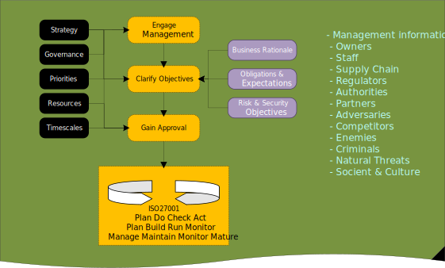

---

##### Published 02/11/2024 10:54:27; Revised: This article is work in progress, which is why its an unfinished mess.

# Information Security Management System (ISMS)

An ISMS approach to managing the security process for a small to medium sized project.

If you work in a project based environment structure where teams of individuals are corralled by a project management team effort to build and deploy a solution, and along the way, you have to work out how to secure the environments being constructed, then this article may help you get a grasp of a methodology that you can start using with relatively low effort.

The background for this article stems from investing time looking at an improved appoach to the controlled risk based methods we can apply to projects

## Contents
- [Introduction](#Introduction)
- [High level conceptual Threat Model](#high-level-conceptual-threat-model)
- [An ISMS approach](#an-isms-approach)
- [ISMS for small projects](#isms-for-small-projects)

## Introduction

The evolution and journey of protecting information system starts with 4 basic principles, which are:
- A. We want to make it difficult for a threat actor to cause disruption
- B. The threat actor must find it difficult to compromise the system, so the actor gives up and tries the systems of another organisation, but mostly because we should at least try to protect our information assets, and keep the actor out of our environments.
- C. Lets just assume that a threat actor will eventually gain access our systems.  We be real here, a threat actor will event gain access to our systems.  There are a lot of talented hackers in the world, and some of them have access to Breach Attack Simulation tooling, and others have access to the WhiteRabbitNeo AI tools which are in the news this week (late October 2024).  Other hackers, no names mentioned, have very deep pockets, and the most comprehensive tools, plus artfully designed, developed, and purchased vendor application backdoors.  So, when a professional hack team eventually steps into our environment, we want all the trip wires and anomalous behaviour monitoring, to fire event notifications at our SIEM/SOAR services.
- D. After the threat actor has accessed our environment, we should try to keep the actor tied down to the original compromised system, and prevent any further pivoting, or expanding of operations. At the very least we can then kick the attacker off the system and perform restore from a good backup point.  Obviously we will mitigate the exploited vulnerabilities and harden the affected system.

With the 4 principles A-D in mind, we start our ISMS journey at stage 1 (see the diagram).

At stage 1:

* the threat actor has developed and acquired tooling, and researched our staff and organisational footprint, and are now ready to start a chain of events that will lead to compromising our systems. It’s worth bearing in mind that ethical hackers report that 90% of the effort to mount a successful attack is focussed on reconnaissance.
* The architecture pattern we designed for the solution has a number of weakness, for example, our internet facing solution does not have a Next Generation Firewall and/or WAF at the border of the public facing network.  Unusual in a professionally managed corporate DMZ, but highly likely in a IaaS cloud solution created by an IT consultancy business, or one of your non IT shadow cloud enthusiasts.
* we on the other hand, have built an asset register and started to appreciate the we have some vulnerabilities that we should mitigate.
* For the most part, the vulnerabilities are bugs in middle tier application systems and host operating system packages.
* There may be configuration weaknesses in our systems, like our Linux password complexity algorithm allows zero length passwords, or poor security policies attached to our Cloud Tenancy.
* There will be zero day vulnerabilities we have no way of finding, until they are published.

## High level conceptual Threat Model

## An ISMS approach

## ISMS for small projects

---
