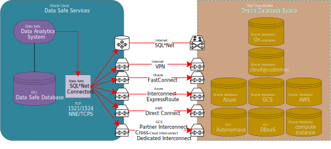

---


##### Published 14/11/2024 17:18:06; Revised: None

# How Oracle database unified_audit_trail ingress to OCI Data Safe works



Oracle **Data Safe** is a security and auditing service that helps organizations monitor, assess, and protect their Oracle Databases. It can read and analyze various database logs, including the **Unified Audit Trail** (`UNIFIED_AUDIT_TRAIL`), to enhance security monitoring, track user activity, and provide insights into potential risks or compliance issues.

## The Data Safe Architecture

The Data Safe service is contained with an Oracle services tenancy, entirely separate from your tenancy.  Authentication and Authorization from the Data Safe service to your individual databases requires a target database user account/password, then network routes and firewall rules to allow network traffic to be established.  Data Safe connects to the target databases over SQL*Net and the recommendation is you configure Native Network Encryption (NNE) or Transport Layer Security (TLS) which Oracle call TCPS.  TCPS with mutual authentication (mTLS), which involves X.509 certificates installed with Data Safe and each target database which is not a simple endeavor in the Oracle ecosystem, unless you are using the Oracle Autonomous database which provides mTLS connection configuration and the X.509 certificates from the OCI dashboard.  Otherwise, managing certificates for every database in your environment will require either a busy team effort and a locally managed Certificate Authority that you manage, or a 3rd party vendor solution like Venafi.

As the Data Safe connectively to the target database is SQL*Net, we can route via the full range of distribution channels such as Oracle FastConnect, Azure ExpressRoute, AWS Direct Connect, and the Google GCS connectors.  A Libreswan VPN connection tunnel across the internet, is only recommended for low cost development or proof of concept environments because you configured the VPN endpoints yourself, the first in Oracle Cloud, and the second on your customer premises equiment (CPE).  However, the VPN bridge will be safer than using SQL*Net across the internet, even though you have in-flight encryption, just keep in mind that for a SQL*Net connection to your target database, your database must support a public endpoint accessible from the internet, but this is a crazy use case, you will not use this use case.

In practice a direct Data Safe SQL*Net connection to a target database through an mTLS/NNE tunnel will be entirely within Oracle Cloud and will never route over the internent.  It is important that this is the only use case for direct SQL*Net connections.

### How Oracle Data Safe Connects to Oracle Database to Read the `UNIFIED_AUDIT_TRAIL`

Oracle Data Safe connects to an Oracle Database in the following way:

### 1. **Data Safe Configuration**

When setting up **Oracle Data Safe** for your Oracle Database, you need to configure it to connect to your database and collect audit data, including reading from the `UNIFIED_AUDIT_TRAIL`.

- **Prerequisites**: Before Data Safe can connect to an Oracle Database, certain conditions must be met:
  - **Unified Auditing** should be enabled in the Oracle Database, which is typically the case if you're using Oracle 12c or later.
  - **Data Safe User**: A specific user (usually `DSA_USER`) is created in the database, and this user must have the necessary privileges to read audit data and perform security assessments.
  - **Granting Privileges**: The user connecting Data Safe to the database must have appropriate privileges, typically the `AUDIT_VIEWER` role or direct `SELECT` access on the `UNIFIED_AUDIT_TRAIL`.

### 2. **Setting Up Oracle Data Safe**

To connect Oracle Data Safe to an Oracle Database, you typically follow these steps:

#### **Step 1: Enable Data Safe in Oracle Cloud**

1. **Log in to the Oracle Cloud Console**: Navigate to the **Oracle Data Safe** service from the main dashboard.
2. **Create a Data Safe Instance**: In Data Safe, create a new **Data Safe instance** if one does not already exist.

#### **Step 2: Register Your Oracle Database with Data Safe**

Once Data Safe is set up, you need to register the target Oracle Database (which you want to monitor) with Data Safe.

1. **Go to the Data Safe Instance** in the Oracle Cloud Console.
2. **Add Database**: Choose to register a new database, and enter details like the **Database Name**, **Service Name**, **Oracle SID**, **Hostname**, and **Connection Details** (including a user that has privileges to query the Unified Audit Trail).
3. **Configure Access Permissions**:
   - During the registration, you will specify a **Data Safe user** (usually `DSA_USER`), which must have the appropriate **SELECT** privileges on the `UNIFIED_AUDIT_TRAIL`.

#### **Step 3: Configure Required Privileges for Data Safe User**

You need to ensure that the `DSA_USER` (or equivalent user) has the following privileges:

1. **Querying Unified Audit Logs**: The user needs **`SELECT`** privileges on the `UNIFIED_AUDIT_TRAIL` in the target Oracle Database.

   Example of granting `SELECT` privilege:

   ```sql
   GRANT SELECT ON UNIFIED_AUDIT_TRAIL TO DSA_USER;
   ```

2. **`AUDIT_VIEWER` Role**: Alternatively, the user can be granted the `AUDIT_VIEWER` role, which includes the necessary permissions to access audit-related tables.

   Example:

   ```sql
   GRANT AUDIT_VIEWER TO DSA_USER;
   ```

#### **Step 4: Data Safe Retrieves Unified Audit Data**

Once the Oracle Database is registered with Oracle Data Safe, and the necessary privileges are granted to the Data Safe user, Data Safe can begin collecting audit data from the database, including reading records from the `UNIFIED_AUDIT_TRAIL`.

- **Audit Collection**: Oracle Data Safe periodically queries the `UNIFIED_AUDIT_TRAIL` to collect audit records, including login attempts, SQL execution, DDL operations, and other database activities. These logs are then used for security analysis and compliance reporting.

- **Data Safe Components**: The collected audit data is typically analyzed in the following components of Oracle Data Safe:
  - **Activity Monitoring**: You can monitor database activities, including user logins, DDL operations, and SQL execution, in real-time or through historical data.
  - **Audit Vault**: The unified audit trail can also be exported and integrated with **Audit Vault** for long-term storage and further analysis.
  - **Sensitive Data Discovery**: Data Safe can also discover sensitive data in your database and assess how it relates to the activity logs.

#### **Step 5: Review Audit Logs in Data Safe**

Once connected, Oracle Data Safe can help you review the unified audit logs. For example, you can:

- **View Audit Trails**: View detailed audit information, such as which users executed which SQL statements, when, and from where.
- **Correlate Events**: Correlate audit data with security events to detect unusual activity (e.g., privilege escalation, failed login attempts, changes to critical data).
- **Generate Reports**: Generate compliance and audit reports for internal audits or external regulatory needs (e.g., GDPR, SOX).

### 3. **Technical Workflow for Reading the Unified Audit Trail**

Here’s an overview of the technical flow:

1. **Database Setup**:
   - Ensure Unified Auditing is enabled in the Oracle Database.
   - Configure a user (such as `DSA_USER`) with sufficient privileges to query the `UNIFIED_AUDIT_TRAIL`.

2. **Data Safe Configuration**:
   - Register the Oracle Database with Oracle Data Safe.
   - Data Safe uses **Oracle Cloud Infrastructure (OCI)** APIs to connect to the target database.
   - Data Safe periodically queries the database to collect unified audit logs from the `UNIFIED_AUDIT_TRAIL`.

3. **Audit Log Access**:
   - Data Safe directly queries the `UNIFIED_AUDIT_TRAIL` using the credentials of the registered **Data Safe user**.
   - The logs are stored and analyzed for security risks, compliance, and audit purposes.

4. **Security and Privacy Considerations**:
   - Ensure that **network security** is in place, such as **Oracle Cloud Infrastructure (OCI) Vault** to store credentials securely.
   - Use **Oracle Data Safe**'s built-in encryption and access control features to protect the audit data.

### 4. **Benefits of Using Oracle Data Safe with Unified Audit Trail**

- **Centralized Audit Monitoring**: Oracle Data Safe allows you to centralize and monitor audit events from your Oracle Database, making it easier to detect and respond to suspicious activities.
- **Real-Time Security Insights**: By continuously collecting audit data, Data Safe provides real-time insights into database activities and potential security risks.
- **Compliance Support**: Data Safe assists with compliance audits by generating reports from the Unified Audit Trail, helping you meet regulatory requirements like GDPR, HIPAA, and SOC 2.
- **Enhanced Data Protection**: With Oracle Data Safe, you get additional capabilities such as sensitive data discovery, data masking, and user activity monitoring.

### Conclusion

Oracle **Data Safe** connects to your Oracle Database via the OCI platform and uses a **Data Safe user** (such as `DSA_USER`) to access and query the `UNIFIED_AUDIT_TRAIL`. It can then collect, analyze, and present audit data, helping you monitor database activity and meet security and compliance requirements.

By leveraging **Data Safe**, you gain enhanced visibility into both Oracle Database-level activities and potential security risks, which makes it a powerful tool for database administrators and security teams.

---
