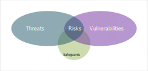

---

##### Published 19/11/2024 10:37:55; Revised: 14/01/2025 19:54:21

# five whimsical cybersecurity thoughts for 2025 based on the top five cybersecurity threats:

1. **AI-Driven Phishing Campaigns**
"By 2025, phishing emails will no longer be from Nigerian princes, but rather from *AI-enhanced, emotionally intelligent* bots that know how to perfectly mimic your boss’s tone. Don’t be surprised if your manager starts asking you for Bitcoin to pay for an 'emergency team-building trip to Mars'."

2. **Ransomware in the Cloud**
"Imagine a future where instead of worrying about your files being locked, you’re waiting for a ransom demand from a cloud server that’s now a sentient being and is negotiating for a higher payout. If you ever hear ‘I am the Cloud, and I demand 2,000 crypto coins for your cat memes,’ just know that it’s not your imagination… it's 2025."

3. **Deepfake CEOs**
"By 2025, expect a rise in ‘Deepfake CEOs’—videos of executives giving important company announcements, only to realize halfway through that the 'CEO' is just an AI-created version of your boss who’s asking for personal info and telling you to ‘click the link for a surprise!’"

4. **Quantum Hacking**
"In the future, quantum computers might just crack your passwords faster than you can say ‘impenetrable encryption.’ But hey, at least the hackers might only take a couple of milliseconds to say ‘please’ before they drain your bank account!"

5. **The Internet of Thieves**
"The Internet of Things is now *The Internet of Thieves*—your smart fridge has a backdoor entry that lets cybercriminals steal your grocery list (and maybe your leftovers). When the fridge starts texting you at 3 a.m. asking for an update on your Wi-Fi password, just know it’s probably *not* your fridge asking about dinner plans."

The future of cybersecurity is sure to be full of both hilarious challenges and bizarre breakthroughs—let's hope we're all ready for the ride!

---