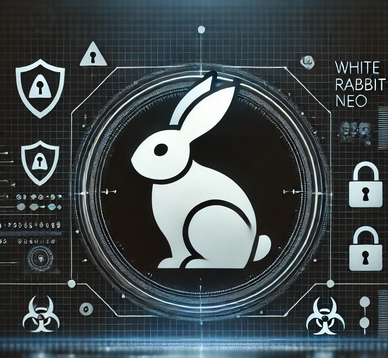

---

##### Published 02/11/2024 10:54:27; Revised: Never

# AI-Driven Cybersecurity Co-Pilot: WhiteRabbitNeo

WhiteRabbitNeo is like a hacker’s Swiss Army knife, designed to streamline both offensive and defensive security tasks using AI. It’s basically an open-source AI model built for pentesting (offensive security) and defense, and it’s catching a lot of attention because of how much it can do. Unlike most AIs, which have a bunch of filters that limit “controversial” responses, WhiteRabbitNeo is uncensored—meaning it can generate code to simulate attacks, test Wi-Fi networks, and even suggest remediation steps if it finds vulnerabilities.

What really makes WhiteRabbitNeo powerful is its access to live data. It’s trained on huge datasets from resources like the National Vulnerability Database (NVD) and open-source threat intel. This lets it stay updated with the latest vulnerabilities and generate relevant security suggestions. It’s almost like having a constantly updated playbook that evolves with new threats. For anyone who’s worked in security, you know how valuable that kind of real-time threat intelligence is. Plus, because it’s open-source, you can adapt and customize it based on what you’re working on.

WhiteRabbitNeo works as a co-pilot for red teams (offensive) and blue teams (defensive). For red teams, it can help create simulations that mirror how attackers would try to exploit a system. For blue teams, it’s all about making intrusion detection and response faster and more automated. Think of it as having a way to automate the more time-consuming security tasks, which frees you up to focus on the big stuff.

Of course, WhiteRabbitNeo’s dual use raises some ethical questions. It’s meant to be used responsibly, but there’s always a risk it could end up in the wrong hands, given that it can be used to simulate real-world attacks. Because of this, people in the industry are recommending that security teams set strict guidelines on how it’s used. It’s similar to Metasploit’s early days, where people worried about misuse, but it ultimately became an industry staple because of its value to professionals. The consensus seems to be that tools like WhiteRabbitNeo can be super helpful, but they also need to be managed carefully.

This platform is a game-changer for cybersecurity pros who need to stay ahead of evolving threats and automate their workflows. Just make sure you’ve got solid guidelines in place if you’re going to deploy it into your network, you may find you own organisation vulnerabilities are leveraged, so be careful, it’s all about responsible use.

---