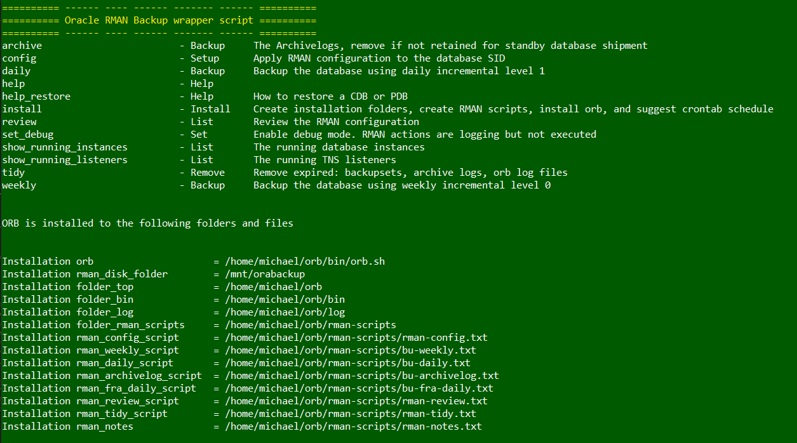

# Oracle: Cloud, Linux, and Database

&nbsp;

# Oracle Database Backup wrapper script

Bash wrapper script that sits between Linux CRON and RMAN to execute backups, weekly tidy, with a 30 day backup retention window.  Backups are configured to  write to Cloud storage mounted on the host (default script variable rman_disk_folder=/mnt/orabackup).

* Use cases
   * Oracle database single instance RMAN backups
   * Oracle RAC database backups
   * Oracle Data Guard database backups.  The script checks the DATABASE_ROLE=PRIMARY and exits if the database is a standby.
   * Weekly backups (incremental level 0) plus archive log
   * Daily backups (incremental level 1) plus archive log
   * Archive log backups seperate from the weekly and daily backups
   * Tidy operations to remove log files over 30 days old
   * Backup retension period is 30 days
   * Backup destination modified by adjusting global variable: rman_disk_folder
   



# Instructions

## Download orb.sh
    * wget https://raw.githubusercontent.com/dns-prefetch/DMZ/main/OracleDatabase/RMAN/orb.sh
    * curl https://raw.githubusercontent.com/dns-prefetch/DMZ/main/OracleDatabase/RMAN/orb.sh > orb.sh

## Install on the database server

The default configurable location (default ~/orb) is modified by editing orb.sh and modifying

```
typeset folder_top=~/orb
 to
typeset folder_top=<your-preferred-folder>/orb
```

Then run the installation

```
orb.sh install
```

## Configure the backup for a single database

Configure the database (instance MySID) to be backed up.  Connects to the database using RMAN and executes a number of "CONFIGURE" commands.

```
  ~/orb/bin/orb.sh config MySID
```

Config suggests a set of crontab entries for the database backup.

```
  @hourly           /home/oracle/orb/bin archive MySID     # Backup the archivelogs every hour
  15 01 * * mon-sat /home/oracle/orb/bin daily   MySID     # Backup the database incremental level 1 and archivelog Monday-Saturday at 01:15
  15 01 * * sun     /home/oracle/orb/bin weekly  MySID     # Backup the database incremental level 0 and archivelog on Sunday at 01:15
  30 01 1 * sun     /home/oracle/orb/bin tidy    MySID     # Remove expired backups, archivelog, and orb backup logs weekly on Sunday at 01:30
```

# Finally, "orb.sh help" is a good place to start, but a few hints follow...

| orb command           | Description                                    |
--- | --- | 
| orb.sh help           | Display help                                   |
| orb.sh config   db21c | Configure the database db21c for backups        |
| orb.sh archive  db21c | Backup the archivelogs for db21c               |
| orb.sh daily    db21c | Daily backup (incremental level 1) for db21c   |
| orb.sh weekly   db21c | Weekly backup (incremental level 0) for db21c  |
| orb.sh tidy     db21c | Remove logs files over 30 days old             |
| orb.sh review   db21c | List the backup summary for db21c              |

## List the installed files
```
   find ~/orb/log
```
## List the log files
```
   find ~/orb/log
```
