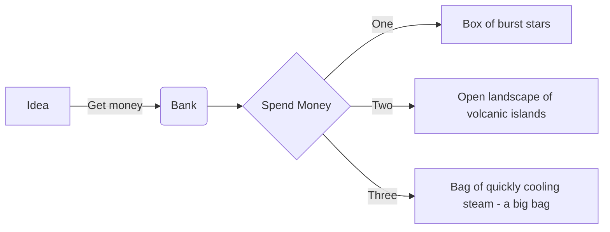

---

These are very basic personal notes I can access on my phone and phablet. One of my hobbies is studying and researching, and this is where I dump really basic stuff I'm thinking about today.

##### Published 22/02/2025 09:15:30; Revised: Never

Flowchar example

AIW (PR-DR-PR) - Acceptable Interruption Window – the maximum allowable downtime before it starts to have an impact on business functions. Our sales platform can be down for 30 minutes without significantly affecting client trust & reputational damage
ALE\
Alternate routing - e.g. microwave or fibre\
BMIS - see diagram\
Competitive Differentiators\
CSF - project delivery factors: people, marketing, etc\
Diverse routing - e.g. duplicate last mile cabling\
Fiduciary Care\
Financial customer internal proces\
innovation and learning\
IR - SSG -> ISM\
ISM -> IMT\
ISM -> IRM -> IRT (Investigator, Incident handler)\
ISO 27001 - Information security, cybersecurity and privacy protection — Information security management systems — Requirements\
ISO/IEC 27004 - Information technology — Security techniques — Information security management — Monitoring, measurement, analysis and evaluation\
ISO 27005 - Information security, cybersecurity and privacy protection — Guidance on managing information security risks\
ISO 62443-2-1 - Security of Industrial Automation and Control Systems\
KGI - measure goal attainment metric\
KPI - measure process efficiency and effectiveness\
KRI - measure security incident trend metrics\
LOLA Listen Observe Learn Act\
Maturity Levels (Partial, Informed, Repeatable, Adaptable)\
MTO - Maximum Tollerable Outage - for given SDO in DR before organisation negatively affected\
NIST 800-37 - Risk Management Framework for Information Systems and Organizations\
NIST 800-53 - Security and Privacy Controls for Information Systems and Organizations\
NIST CSF - Cybersecurity Framework\
NIST SP 800-30 - Rev 1 Guide for Conducting Risk Assessments\
RACI - risk treatment\
Rgulation\
ROSI\
SABSA\
Security balanced score card\
TOGAF\
Zachman framework\

---
